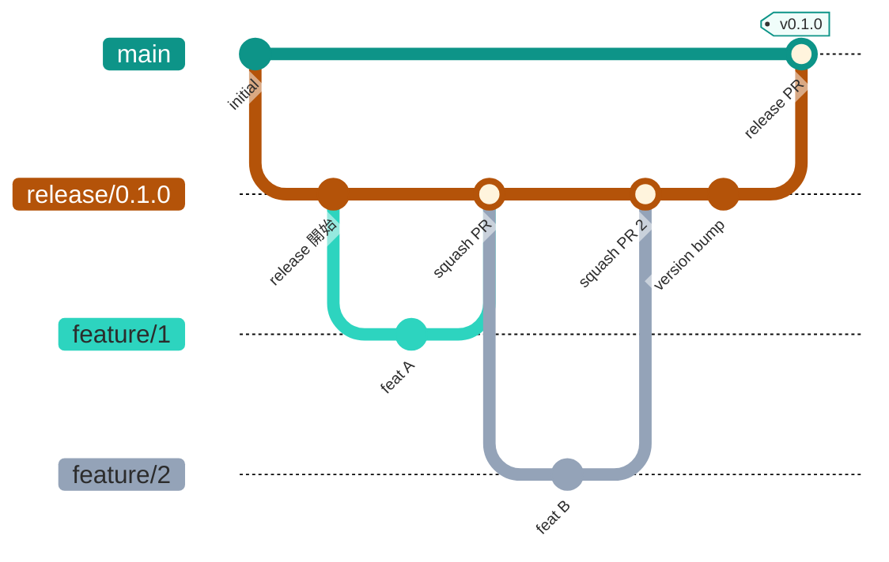
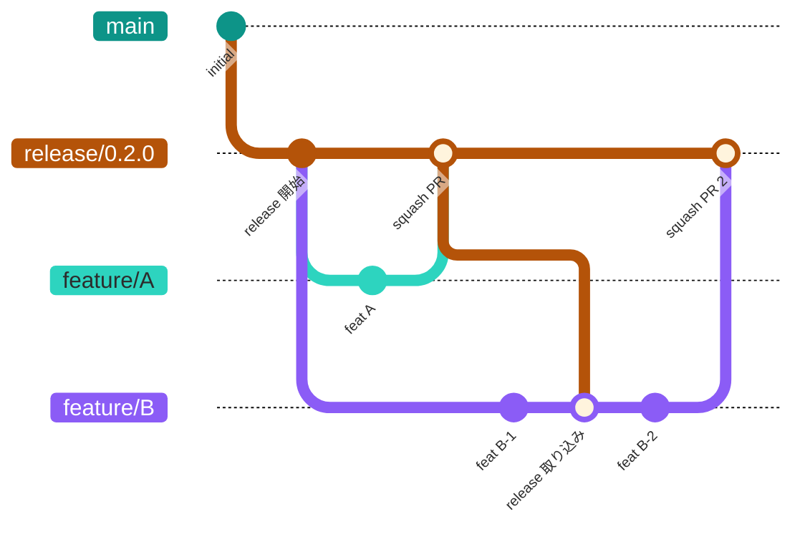
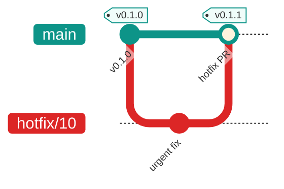

# ブランチ戦略

## 1. サマリー

- GitHub Flow を採用する。運用は GitHub Flow with integration branches とし、リリース単位の統合ブランチ (`release/*`) を加えて、複数の変更をまとめて検証してから `main` に入れる。
- リリースサイクルごとに `main` から `release/X.Y.Z` を 1 本切り、変更は `release/X.Y.Z` から `feature/*` を派生させて行う。完成した feature から順に `release/X.Y.Z` へ squash マージし、最終的に `release/X.Y.Z` を `main` へ戻してタグを打ち、npm に公開する。
- **同時に存在するリリースブランチは 1 本のみ。** 前のリリースが `main` にマージされてから次を切る。
- markterm は npm パッケージなので、デプロイ環境は持たない。`main` のタグ `vX.Y.Z` = npm に公開されたバージョン、`release/*` = 次バージョンの候補、という対応になる。
- ゲートは CI (`.github/workflows/ci.yml` の `required-check`) 1 つ。型検査、`bun test`（ユニット、Chromium を使う結合、CLI 起動）、ビルド、ビルド成果物のスモークテストを含む。`release/*` と `main` への PR の必須チェックにする。

## 2. ブランチ一覧

| ブランチ | 役割 | 分岐元 | マージ先 | 公開先 | 保護 | マージ方式 |
| --- | --- | --- | --- | --- | --- | --- |
| `main` | 公開済みの現在地。タグ `vX.Y.Z` を打つ唯一のブランチ | (初期) | なし | npm (`npm publish` を手動実行) | 必須チェック、直接 push 禁止、force push 禁止、削除禁止 | マージコミット (squash しない) |
| `release/X.Y.Z` | リリースサイクルの統合ブランチ。feature の PR 先。同時に 1 本のみ | `main` | `main` | なし | 必須チェック、直接 push 禁止、Require up to date、force push 禁止 | `main` へはマージコミット |
| `feature/<issue>_<desc>` | 個別の変更 | `release/*` | `release/*` | なし | なし | squash |
| `hotfix/<issue>_<desc>` | 公開済みバージョンの緊急修正 | `main` | `main` | 修正後に npm 公開 | `main` と同じ | マージコミット |

命名は `feature/<Issue 番号>_<説明>` (例: `feature/1_release-prep-docs-tests-ci`)。`release/` はセマンティックバージョン、`hotfix/` は `feature/` と同じ規則。Issue 番号は GitHub Issues の番号を使う。

## 3. ブランチの流れ

### 3.1 通常のリリースサイクル



- `main` から `release/0.1.0` を切る。
- `release/0.1.0` から `feature/*` を派生させ、完成順に squash で戻す。
- リリース前の修正 (バージョン更新、CHANGELOG の整理) は `release/0.1.0` に直接 PR で入れる (機能追加は入れない)。
- 全通過後、`release/0.1.0` を `main` にマージコミットし、タグを打って npm に公開する。`release/0.1.0` は削除する。

### 3.2 並列開発と release の取り込み

開発期間が長い feature は、途中で最新の `release/*` を取り込む (merge または rebase)。



- feature/A と feature/B が同時に `release/0.2.0` から派生する。
- feature/A が先に完成し、`release/0.2.0` に squash マージされる。
- feature/B は最新の `release/0.2.0` を取り込み、コンフリクトを解消してから開発を続ける。
- feature/B が完成したら `release/0.2.0` に squash マージする。

### 3.3 hotfix

公開済みバージョンの緊急修正は `main` から直接分岐する。



- `main` から `hotfix/*` を切り、修正を入れる。
- `required-check` 通過後に `main` へマージコミットし、タグを打って npm に公開する。
- 進行中の `release/*` があれば、hotfix の修正を cherry-pick する。

## 4. ゲート

| ゲート | 適用先 | 内容 |
| --- | --- | --- |
| `required-check` | `release/*`、`main` への PR | `.github/workflows/ci.yml` が全通過。`bun run typecheck`、`bun test`、`bun run build`、ビルド成果物の `--version` と `-o` のスモークテスト |
| 公開前の手動確認 | `release/*` から `main` への PR | 実機のターミナル (Ghostty など) でインライン表示を目視確認し、結果を PR 本文に記録する。CI はヘッドレスなのでインライン表示の経路は自動検証できない |

レビュー承認は現状 0 名 (単独開発)。共同開発者が加わった時点で `main` への PR に 1 名以上の承認を必須にする。

## 5. PR のルール

| 項目 | ルール |
| --- | --- |
| base ブランチ | `feature/*` -> `release/*`。`release/*` -> `main`。`hotfix/*` -> `main` |
| マージ方式 | `feature/*` は squash。`release/*` と `hotfix/*` は merge commit (履歴とタグの対応を残す)。rebase merge はリポジトリ設定で無効化する |
| 必須条件 | `required-check` 通過 |
| PR の粒度 | 1 Issue 1 PR。Issue 番号をブランチ名と PR タイトルに含める |
| 直接 push | `release/*`、`main` は禁止。force push も禁止 |
| マージ後 | head ブランチは自動削除 (リポジトリ設定 `delete_branch_on_merge`) |

### ブランチ保護の設定 (GitHub Rulesets)

リポジトリは gospelo-dev ユーザー所有のため、設定は所有者アカウントで行う (コラボレーターの権限は write まで)。

- `main`: PR 必須、`required-check` 必須 (Require up to date)、force push 禁止、削除禁止、許可するマージ方式は merge と squash
- `release/**`: PR 必須、`required-check` 必須 (Require up to date)、force push 禁止、許可するマージ方式は squash

**開発者が対応すること:**

- PR 画面で「This branch is out-of-date with the base branch」と表示されたら、feature ブランチで `git merge release/X.Y.Z` または `git rebase release/X.Y.Z` を実行して最新を取り込む。
- CI が失敗したらログを確認して修正し、再 push する。

## 6. リリース手順

1. 前のリリースブランチが `main` にマージ済みであることを確認する。
2. `main` から `release/X.Y.Z` を作成し push する。
3. `release/X.Y.Z` から `feature/*` を派生させ、`release/X.Y.Z` に PR で squash マージする。
4. 変更が揃ったら、`package.json` の `version` を `X.Y.Z` に更新し、`CHANGELOG.md` の `(unreleased)` を日付に置き換える PR を `release/X.Y.Z` に入れる。
5. 実機のターミナルで `bun run build && bun dist/cli.js README.md` を実行し、インライン表示を確認する。
6. `release/X.Y.Z` -> `main` の PR を作成する。手動確認の結果 (日時、コミット、ターミナル) を PR 本文に記録する。
7. `required-check` 通過後、merge commit でマージする。
8. `main` で `git tag vX.Y.Z && git push origin vX.Y.Z` を実行する。
9. `gospelo-github-identity check` と `npm whoami` で公開アカウントを確認し、`main` で `npm publish` を実行する (`prepublishOnly` がビルドする)。
10. `release/X.Y.Z` を削除する。

## 7. hotfix 手順

1. `main` から `hotfix/<issue>_<desc>` を作成する。
2. 修正と `package.json` のパッチバージョン更新、CHANGELOG の追記を入れ、`hotfix/*` -> `main` の PR を作成する。
3. `required-check` 通過後、merge commit でマージし、`vX.Y.Z+1` タグを打って npm に公開する。
4. 進行中の `release/*` があれば、hotfix の修正を cherry-pick する。

## 8. リリースブランチの運用ルール

### 同時 1 本の原則

複数のリリースブランチが同時に存在すると、ブランチ間のマージ・コンフリクト管理が複雑になる。これを防ぐため、以下を守る:

- リリースブランチは常に 1 本のみ。次のリリースブランチは前のが `main` にマージされてから切る。
- 次リリースの機能開発を先に始めたい場合は、`main` から feature ブランチだけ先に切っておき、次の `release/*` が作成されてからそこに PR を出す。

### 避けるべきパターン

| パターン | 問題 |
| --- | --- |
| リリースブランチが 2 本以上同時に存在 | マージ順序の管理が必要になり、コンフリクト多発 |
| feature を複数の release に cherry-pick | 同じ変更の二重管理、適用漏れのリスク |
| release -> main のマージを後回し | main との乖離が拡大し、次リリースの開始が遅延 |

## 9. 移行状況

| 項目 | 状態 | 備考 |
| --- | --- | --- |
| `main` のクリーンな作り直し | 完了 | 2026-09-22 に orphan の 1 コミット (`538bd12`) で置き換え。旧履歴は `backup/main-pre-rewrite-20260922` に保存 |
| `release/0.1.0` の作成 | 完了 | `main` から作成し push 済み |
| 最初の feature PR | 進行中 | `feature/1_release-prep-docs-tests-ci` (Issue #1) |
| CI (`required-check`) | 本 PR で追加 | `.github/workflows/ci.yml` |
| リポジトリ設定 (rebase merge 無効、マージ後ブランチ削除) | 未 | 所有者アカウント (gospelo-dev) で実行 |
| `main` / `release/**` の Rulesets | 未 | 所有者アカウント (gospelo-dev) で実行。JSON は本節末を参照 |
| `backup/main-pre-rewrite-20260922` の扱い | 未 | 0.1.0 公開後に削除する |
| npm 公開アカウントの認証 | 未 | `npm login` を実行してから `npm whoami` で確認 |

### 所有者アカウントで実行するコマンド

```bash
# マージ方式の制限とマージ後のブランチ自動削除
gh api repos/gospelo-dev/markterm --method PATCH \
  -F allow_rebase_merge=false -F allow_squash_merge=true -F allow_merge_commit=true \
  -F delete_branch_on_merge=true \
  -f squash_merge_commit_title=PR_TITLE -f squash_merge_commit_message=PR_BODY

# Rulesets (JSON はリポジトリの scratch/ ではなく下記を保存して使う)
gh api repos/gospelo-dev/markterm/rulesets --method POST --input ruleset-main.json
gh api repos/gospelo-dev/markterm/rulesets --method POST --input ruleset-release.json
```

ruleset-main.json:

```json
{
  "name": "Main branch protection",
  "target": "branch",
  "enforcement": "active",
  "conditions": { "ref_name": { "include": ["refs/heads/main"], "exclude": [] } },
  "rules": [
    { "type": "deletion" },
    { "type": "non_fast_forward" },
    { "type": "pull_request", "parameters": {
        "required_approving_review_count": 0,
        "dismiss_stale_reviews_on_push": false,
        "require_code_owner_review": false,
        "require_last_push_approval": false,
        "required_review_thread_resolution": false,
        "allowed_merge_methods": ["merge", "squash"] } },
    { "type": "required_status_checks", "parameters": {
        "strict_required_status_checks_policy": true,
        "required_status_checks": [ { "context": "required-check" } ] } }
  ]
}
```

ruleset-release.json:

```json
{
  "name": "Release branch protection",
  "target": "branch",
  "enforcement": "active",
  "conditions": { "ref_name": { "include": ["refs/heads/release/**"], "exclude": [] } },
  "rules": [
    { "type": "non_fast_forward" },
    { "type": "pull_request", "parameters": {
        "required_approving_review_count": 0,
        "dismiss_stale_reviews_on_push": false,
        "require_code_owner_review": false,
        "require_last_push_approval": false,
        "required_review_thread_resolution": false,
        "allowed_merge_methods": ["squash"] } },
    { "type": "required_status_checks", "parameters": {
        "strict_required_status_checks_policy": true,
        "required_status_checks": [ { "context": "required-check" } ] } }
  ]
}
```

共同開発者が加わったら、`main` の `required_approving_review_count` を 1 に上げる。
